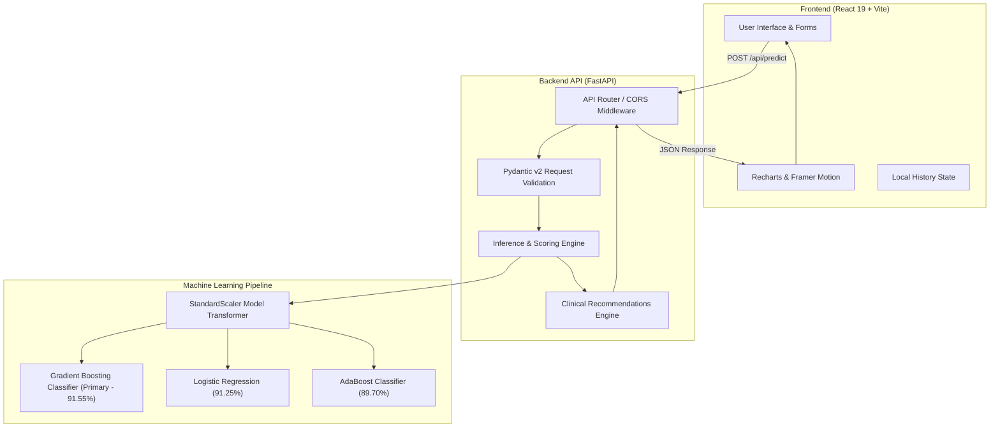

# 🫀 CardioCare AI — Cardiovascular Disease Prediction & Clinical Decision Support

[](https://cardiovascular-ml-project-one.vercel.app/)
[](https://fastapi.tiangolo.com/)
[](https://react.dev/)
[](https://scikit-learn.org/)
[](https://vitejs.dev/)
[](https://tailwindcss.com/)

> **CardioCare AI** is an end-to-end clinical machine learning decision support system designed for early screening, risk stratification, and patient lifestyle intervention for cardiovascular disease (CVD). Powered by an ensemble of calibrated ML classifiers and served through a modern reactive web interface.

🌐 **Production Application:** [https://cardiovascular-ml-project-one.vercel.app/](https://cardiovascular-ml-project-one.vercel.app/)  
📂 **Repository:** [https://github.com/h-240407/cardiovascular-ml-project](https://github.com/h-240407/cardiovascular-ml-project)

---

## 📌 Table of Contents

- [Overview](#-overview)
- [Key Features](#-key-features)
- [Live Demo & Screenshots](#-live-demo--screenshots)
- [System Architecture](#-system-architecture)
- [Machine Learning Pipeline & Benchmarks](#-machine-learning-pipeline--benchmarks)
- [Clinical Features & Data Dictionary](#-clinical-features--data-dictionary)
- [Tech Stack](#-tech-stack)
- [Repository Structure](#-repository-structure)
- [API Reference](#-api-reference)
- [Local Setup & Installation](#-local-setup--installation)
- [Deployment Guide](#-deployment-guide)
- [Clinical Disclaimer](#-clinical-disclaimer)
- [License](#-license)

---

## 🔬 Overview

Cardiovascular diseases (CVDs) remain the leading cause of mortality worldwide. Early detection based on non-invasive physiological biometrics (blood pressure, blood glucose, cholesterol, BMI, and lifestyle habits) enables actionable medical intervention before severe cardiac events occur.

**CardioCare AI** bridges production data science and modern frontend engineering:
1. **Clinical Machine Learning**: Trains and validates multiple models (Gradient Boosting, Logistic Regression, AdaBoost) over 8,000 patient records.
2. **Probability Calibration & Interpretability**: Benchmarks accuracy, F1-score, ROC-AUC, and Residual Sum of Squares (Brier score) alongside feature importance analysis.
3. **Production FastAPI Service**: Exposes high-throughput, schema-validated REST endpoints for instantaneous inference and population analytics.
4. **Vercel-Deployed Frontend**: A responsive, accessible single-page application built with React 19, Recharts visualizations, and Framer Motion micro-interactions.

---

## ✨ Key Features

- **🎯 Multi-Model Inference Switcher**: Evaluate predictions using Gradient Boosting (Primary), Logistic Regression, or AdaBoost with dynamic model selection.
- **⚡ Real-Time Cardiac Risk Scoring**: Instant calculation of risk percentage, stratified risk category (`Low Risk 🟢`, `Moderate Risk 🟡`, `High Risk 🔴`), and calculated Body Mass Index (BMI).
- **📋 Targeted Clinical Recommendations**: Dynamic rules engine delivering lifestyle guidance tailored to individual BP readings, cholesterol level, glycemic state, smoking habits, and activity index.
- **📊 Interactive Model Analytics**: Dedicated telemetry dashboard rendering feature importance bar charts, comparative ROC-AUC metrics, and probability calibration stats.
- **📈 Population Health Insights**: Dynamic scatter plots and distribution metrics exploring patient age versus systolic blood pressure across 8,000 clinical records.
- **📑 Patient Screening History**: Client-side encrypted history logging of previous assessments with quick-review scorecards.
- **💡 Educational Heart Health Hub**: Curated medical guidance on nutrition, aerobic exercise, stress reduction, and healthy vascular habits.
- **🌗 Responsive & Polished UX**: Glassmorphism aesthetic, accessible contrast ratios, and fluid mobile/desktop layouts.

---

## 🚀 Live Demo & Screenshots

Experience the live deployed application at:  
👉 **[https://cardiovascular-ml-project-one.vercel.app/](https://cardiovascular-ml-project-one.vercel.app/)**

| Dashboard & Risk Screening | Interactive Population Insights |
| :---: | :---: |
| Real-time patient biometric inputs with instant probability feedback | Scatter distributions of age vs systolic blood pressure |

| Model Performance Benchmark | Clinical Recommendations |
| :---: | :---: |
| Comparative metrics between Gradient Boosting, Logistic Regression, & AdaBoost | Tailored lifestyle steps based on detected biometric anomalies |

---

## 🏛️ System Architecture



---

## 🧠 Machine Learning Pipeline & Benchmarks

The dataset consists of **8,000 clinical patient examinations** processed through a rigorous scikit-learn workflow:

1. **Preprocessing & Imputation**: Missing continuous values (e.g., height) imputed via the statistical median to maintain resilience against skewness.
2. **Physiological Filtering**: Outliers filtered to conform to viable human physiological boundaries (`ap_hi` $\in (60, 220)$ mmHg, `ap_lo` $\in (40, 160)$ mmHg).
3. **Stratified Split**: 80% Training / 20% Testing split ensuring class balance preservation ($50\%$ healthy, $50\%$ CVD).
4. **Standardization**: `StandardScaler` fitted exclusively to the training distribution and transformed across testing sets to prevent data leakage.

### 🏆 Benchmark Comparison

| Model | Accuracy | F1-Score | ROC-AUC | RSS (Brier) | 5-Fold CV Score | Deployment Status |
| :--- | :---: | :---: | :---: | :---: | :---: | :---: |
| **Gradient Boosting** *(Tuned)* | **91.55%** | **91.49%** | **0.9769** | **243.56** | **65.48%** | 🚀 **Primary Deployed** |
| **Logistic Regression** | 91.25% | 91.16% | 0.9784 | 237.60 | — | Available |
| **AdaBoost Classifier** | 89.70% | 89.39% | 0.9674 | 503.70 | — | Available |

*RSS (Residual Sum of Squares): Lower score demonstrates superior continuous probability calibration.*

### 🔍 Feature Importance Breakdown (Gradient Boosting)

| Feature | Clinical Metric | Relative Importance | Impact Ranking |
| :--- | :--- | :---: | :---: |
| `ap_hi` | Systolic Blood Pressure | **58.63%** | 🥇 Primary Driver |
| `age` | Patient Age (Years) | **19.54%** | 🥈 Secondary Driver |
| `cholesterol` | Serum Cholesterol Category | **9.30%** | 🥉 Major Contributor |
| `active` | Physical Activity Level | **3.60%** | Relevant Lifestyle |
| `gluc` | Fasting Glucose Level | **3.57%** | Relevant Metabolic |
| `ap_lo` | Diastolic Blood Pressure | **2.89%** | Cardiovascular Load |
| `smoke` | Tobacco Smoker Status | **1.40%** | Vascular Risk |
| `weight` | Body Mass (kg) | **0.65%** | Metabolic Indicator |
| `height` | Stature (cm) | **0.39%** | Geometric Factor |
| `alco` | Alcohol Consumption | **0.02%** | Behavioral Factor |
| `gender` | Biological Sex | **0.01%** | Demographic Factor |

---

## 📋 Clinical Features & Data Dictionary

| Feature | Type | Unit / Encoding | Description |
| :--- | :---: | :---: | :--- |
| `age` | Integer | Years ($35 - 64$) | Patient chronological age |
| `gender` | Categorical | `1`: Female, `2`: Male | Biological sex |
| `height` | Float | cm | Body stature |
| `weight` | Float | kg | Body mass |
| `ap_hi` | Integer | mmHg | Systolic arterial blood pressure during cardiac contraction |
| `ap_lo` | Integer | mmHg | Diastolic arterial blood pressure during resting phase |
| `cholesterol` | Categorical | `1`: Normal, `2`: Above Normal, `3`: High | Total serum cholesterol level |
| `gluc` | Categorical | `1`: Normal, `2`: Above Normal, `3`: High | Fasting blood glucose level |
| `smoke` | Binary | `0`: Non-smoker, `1`: Smoker | Tobacco consumption |
| `alco` | Binary | `0`: Non-drinker, `1`: Drinker | Alcohol intake |
| `active` | Binary | `0`: Inactive, `1`: Physically Active | Regular physical activity |
| **`cardio`** | **Binary Target** | **`0`: Absence, `1`: Diagnosed CVD** | **Ground truth target variable** |

---

## 💻 Tech Stack

### Machine Learning & Data Science
- **Python 3.10+**
- **Scikit-Learn 1.6.1** — Classifier pipelines, cross-validation, metrics
- **Joblib 1.4.2** — Model & scaler serialization
- **Pandas & NumPy** — Tabular transformation & mathematical operations
- **Matplotlib & Seaborn** — Exploratory data analysis & feature importance

### Backend Services
- **FastAPI 0.115+** — Asynchronous RESTful API framework
- **Pydantic v2** — Strict data validation and schema serialization
- **Uvicorn** — Production ASGI server

### Frontend Application
- **React 19** — Component-driven reactive user interface
- **Vite 8** — Next-generation blazing fast frontend tooling
- **Tailwind CSS v4** — Utility-first styling framework
- **Recharts 3** — Composable data visualization charts
- **Framer Motion 13** — Production-ready UI micro-animations
- **Lucide React** — Medical & UI iconography
- **Canvas Confetti** — Delighting visual feedback for healthy outcomes

### Hosting & DevOps
- **Vercel** — Global Edge CDN deployment for frontend
- **Render / Uvicorn** — Backend cloud deployment

---

## 📁 Repository Structure

```plaintext
cardiovascular-ml-project/
├── backend/
│   ├── main.py                  # FastAPI application, route handlers & business logic
│   └── schemas.py               # Pydantic models for request/response serialization
├── frontend/
│   ├── public/                  # Static assets & redirects configuration
│   ├── src/
│   │   ├── components/          # Reusable UI components (AppShell, Navbar, Cards)
│   │   ├── pages/               # Views: Dashboard, Prediction, Analytics, Insights, etc.
│   │   ├── api.js               # Centralized Axios/Fetch client with environment fallbacks
│   │   ├── App.jsx              # Application router & navigation hierarchy
│   │   └── main.jsx             # React DOM entry point
│   ├── package.json             # Frontend dependencies & npm scripts
│   └── vite.config.js           # Vite build & plugin settings
├── model/
│   ├── cardio_model.pkl         # Serialized Gradient Boosting Classifier
│   ├── logistic_model.pkl       # Serialized Logistic Regression Classifier
│   ├── adaboost_model.pkl       # Serialized AdaBoost Classifier
│   ├── scaler.pkl               # Serialized StandardScaler object
│   └── feature_names.pkl        # List of input feature names
├── data/
│   └── cardio_data.csv          # Clinical cardiovascular dataset (8,000 rows)
├── cardio_model.ipynb           # Model development, EDA, training & evaluation notebook
├── VIVA_MODEL_EXPLANATION.md    # Detailed mathematical derivations & viva defense guide
├── requirements.txt             # Python runtime dependencies
└── README.md                    # Project documentation
```

---

## 🔌 API Reference

### 1. Health Check
```http
GET /api/health
```
**Response:**
```json
{
  "status": "healthy",
  "service": "Cardio Care API",
  "model_loaded": true,
  "models_available": ["Gradient Boosting", "Logistic Regression", "AdaBoost"],
  "accuracy": "91.6%"
}
```

---

### 2. Predict Cardiovascular Risk
```http
POST /api/predict
Content-Type: application/json
```

**Request Payload:**
```json
{
  "age": 52,
  "gender": 2,
  "height": 172.0,
  "weight": 80.0,
  "ap_hi": 140,
  "ap_lo": 90,
  "cholesterol": 2,
  "gluc": 1,
  "smoke": 0,
  "alco": 0,
  "active": 1,
  "model": "gradient_boosting"
}
```

**Response Payload:**
```json
{
  "prediction": 1,
  "probability_pct": 74,
  "risk_level": "High Risk 🔴",
  "bmi": 27.0,
  "status_message": "High cardiovascular risk detected! We recommend scheduling a medical checkup soon.",
  "is_high_risk": true,
  "recommendations": [
    "Monitor your blood pressure regularly and aim to reduce sodium in your diet.",
    "Increase healthy fats (avocados, nuts) and limit saturated fats to lower cholesterol.",
    "Your BMI is 27.0. Maintaining a balanced diet can help optimize heart workload."
  ],
  "model_used": "Gradient Boosting"
}
```

---

### 3. Model Analytics & Telemetry
```http
GET /api/model-analytics
```
Returns benchmark metrics (Accuracy, F1, ROC-AUC, RSS, CV Score) and feature importance distributions.

---

### 4. Population Health Insights
```http
GET /api/insights
```
Returns demographic aggregates and sample points for scatter plot visualization.

---

## 🛠️ Local Setup & Installation

### Prerequisites
- **Python 3.10+**
- **Node.js 18+ & npm**
- **Git**

### 1. Clone the Repository
```bash
git clone https://github.com/h-240407/cardiovascular-ml-project.git
cd cardiovascular-ml-project
```

### 2. Backend Setup
```bash
# Navigate to project root
# Create virtual environment
python -m venv venv

# Activate virtual environment
# Windows (PowerShell):
.\venv\Scripts\Activate.ps1
# macOS/Linux:
source venv/bin/activate

# Install dependencies
pip install -r requirements.txt

# Run the FastAPI server
uvicorn backend.main:app --host 0.0.0.0 --port 8000 --reload
```
*API will run at `http://localhost:8000` with interactive Swagger docs at `http://localhost:8000/docs`.*

### 3. Frontend Setup
Open a second terminal:
```bash
cd frontend

# Install npm dependencies
npm install

# Start development server
npm run dev
```
*Frontend will be running at `http://localhost:5173`.*

---

## 🌐 Deployment Guide

### Frontend on Vercel
1. Link your GitHub repository to [Vercel](https://vercel.com/).
2. Set Root Directory to `frontend`.
3. In Build Settings:
   - **Framework Preset**: Vite
   - **Build Command**: `npm run build`
   - **Output Directory**: `dist`
4. In Environment Variables:
   - `VITE_API_BASE_URL`: URL of your deployed backend service (e.g. `https://your-backend.onrender.com`).
5. Deploy!

### Backend on Render / Railway
1. Create a new **Web Service** connected to your repository.
2. Set Build Command: `pip install -r requirements.txt`
3. Set Start Command: `uvicorn backend.main:app --host 0.0.0.0 --port $PORT`

---

## ⚠️ Clinical Disclaimer

> **IMPORTANT MEDICAL NOTICE:** CardioCare AI is an academic machine learning research project and decision support demonstration tool. It is **not** a certified medical diagnostic device and should **never** replace professional medical diagnosis, laboratory testing, clinical judgment, or emergency consultation. If you or someone you know experiences chest pain, shortness of breath, or cardiac symptoms, seek immediate emergency medical care.

---

## 📄 License

This project is licensed under the **MIT License** — feel free to use, modify, and distribute for academic and educational purposes.

---

**Developed with ❤️ for Cardiovascular Health & Preventative Medicine**  
For technical inquiries, contributions, or questions, please open an Issue or pull request on [GitHub](https://github.com/h-240407/cardiovascular-ml-project).
